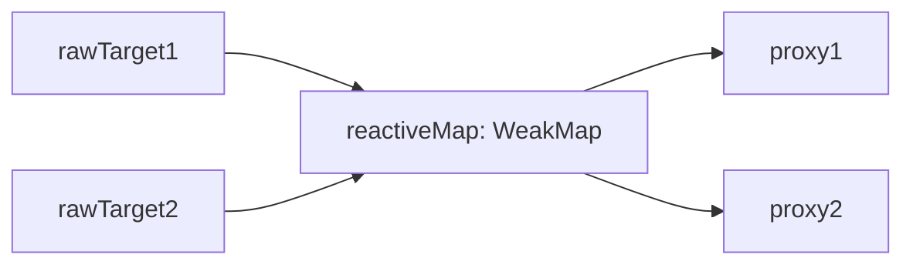
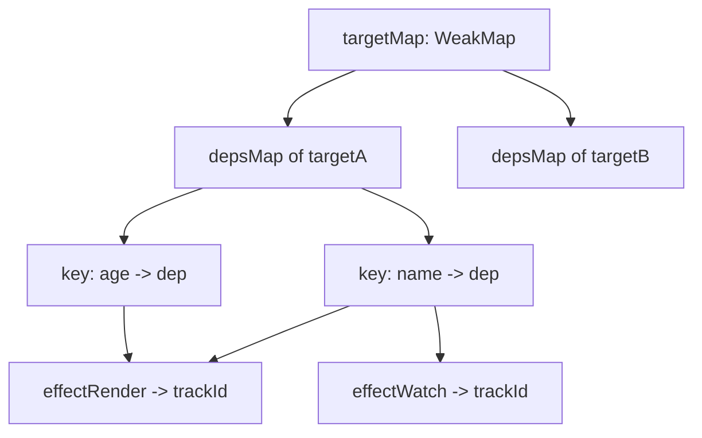
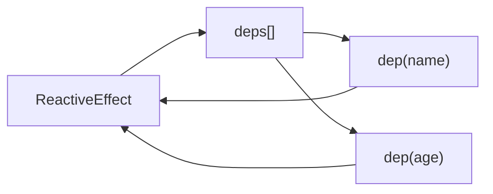

# Vue3 响应式模块学习总结（简易实现版）

> 对应目录：`packages/reactivity/src`

## 1. 这个模块做了什么

你这套实现已经覆盖了 Vue3 响应式的核心能力：

- `reactive`：把对象变成响应式对象（基于 `Proxy`）
- `effect`：建立“读取依赖 -> 数据变化后重新执行”的副作用机制
- `ref`：让基本类型/单值也能参与响应式
- `computed`：基于 effect 的“懒执行 + 缓存 + 脏检查”
- `watch / watchEffect`：监听源变化并执行回调，支持 cleanup

---

## 2. 代码分层理解

### A. 代理层：`reactive.ts` + `baseHandler.ts`

职责：把普通对象包装成代理对象，并在 `get/set` 时接入依赖系统。

关键点：

- 使用 `WeakMap` (`reactiveMap`) 缓存“原对象 -> 代理对象”
- 避免重复代理（已代理对象直接返回）
- `get`：调用 `track(target, key)` 收集依赖
- `set`：值变化后调用 `trigger(target, key, newValue, oldValue)` 触发更新
- 对嵌套对象采用懒代理：读取到对象时才递归 `reactive`

### B. 依赖收集与触发层：`reactiveEffect.ts`

职责：维护属性和 effect 的关系图。

核心结构：

- `targetMap: WeakMap`
- `targetMap.get(target) -> depsMap(Map<key, dep>)`
- `dep` 是一个 `Map<effect, trackId>`（并附加了 `cleanup`）

一句话：

- `track` 在读的时候记录“谁依赖了我”
- `trigger` 在写的时候找到“我该通知谁”

### C. 执行器层：`effect.ts`

职责：描述一个可追踪、可调度、可停止的响应式副作用。

`ReactiveEffect` 关键能力：

- `run()`：
  - 设置 `activeEffect`
  - 执行用户函数并触发依赖收集
  - 执行前后做依赖预清理 / 后清理
- `scheduler`：变化时不一定直接 `run`，可走调度逻辑
- `stop()`：停止响应式跟踪并清理依赖
- `dirty` / `_dirtyLevel`：给计算属性提供脏标记基础

### D. 单值响应式层：`ref.ts`

职责：让单值（尤其基本类型）具备响应式行为。

关键点：

- `RefImpl` 内部持有 `rawValue` 和 `_value`
- `get value` 时 `trackRefValue(this)`
- `set value` 值变化时 `triggerRefValue(this)`
- 对象值会通过 `toReactive` 自动变成 `reactive`
- `toRef/toRefs/proxyRefs` 解决结构解构、自动脱 ref 等使用体验问题

### E. 派生与侦听层：`computed.ts` + `apiWatch.ts`

职责：

- `computed`：派生状态（缓存结果、依赖变化时标脏）
- `watch`：监听变化并执行回调，支持 `immediate` 与 cleanup
- `watchEffect`：自动收集依赖并立即执行

---

## 3. 一句话主链路

- 读：`Proxy.get -> track -> 记录 effect`
- 写：`Proxy.set -> trigger -> 调度 effect.run`
- 派生：`computed` 在访问时计算，在依赖变化时标脏并通知外层
- 侦听：`watch` 用 scheduler 接管更新时机并管理 `old/new` 与 cleanup

---

## 4. 核心数据结构图（重点记忆）

### 4.1 `reactiveMap`：原对象到代理对象的缓存

可以把它理解为：

- `reactiveMap.get(rawTarget) => proxy`
- 用途：避免同一个对象被重复 `new Proxy(...)`
- 因为是 `WeakMap`，`rawTarget` 无引用时可被 GC 回收

### 4.2 `targetMap`：依赖收集总索引

层级关系（从外到内）：

- 第 1 层：`targetMap: WeakMap<target, depsMap>`
- 第 2 层：`depsMap: Map<key, dep>`
- 第 3 层：`dep: Map<effect, trackId>`

### 4.3 `dep` 与 `effect` 的双向关系

这就是你代码里“能清理旧依赖”的基础：

- `effect.deps` 记录了“我依赖了哪些 dep”
- `dep` 里记录了“哪些 effect 依赖我”
- 运行前后对比后可删除过期依赖

---

## 5. 学习建议（按顺序）

1. 先手画 `targetMap` 的三层结构（target / key / dep）
2. 跑通一次 `reactive + effect`
3. 再看 `ref` 如何复用 `trackEffect/triggerEffects`
4. 再看 `computed` 的 dirty 行为
5. 最后看 `watch` 的 `job + cleanup`
