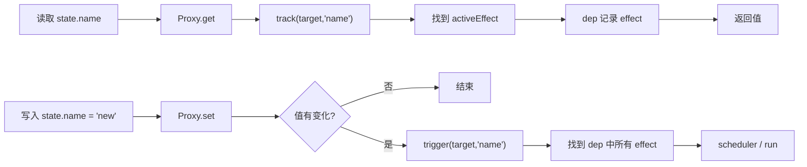
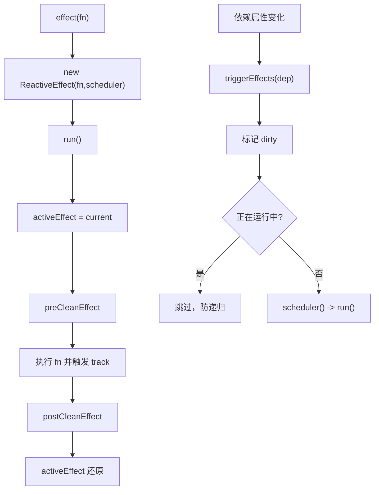
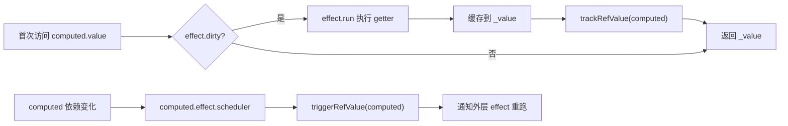
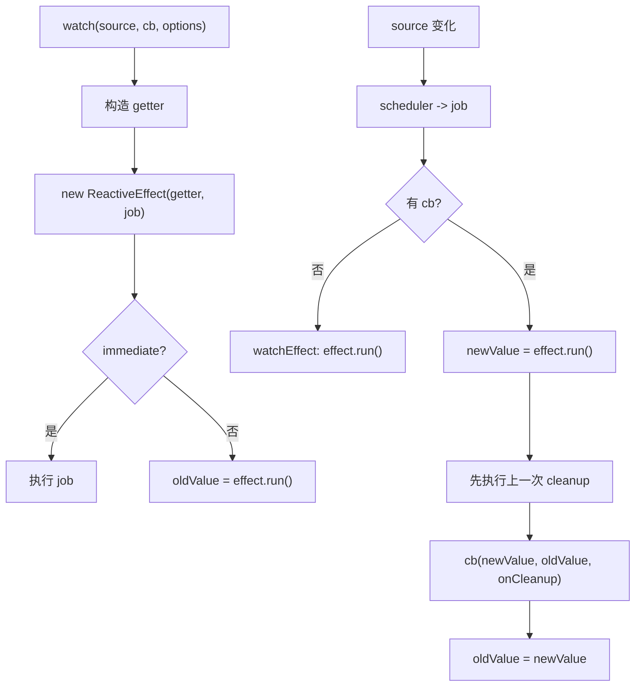

# 响应式核心流程图（Mermaid）

> 可以直接在支持 Mermaid 的 Markdown 预览中查看。

## 1) reactive 对象：读取与修改

```mermaid
flowchart LR
  A["读取 state.name"] --> B["Proxy.get"]
  B --> C["track(target,'name')"]
  C --> D["找到 activeEffect"]
  D --> E["dep 记录 effect"]
  E --> F["返回值"]

  G["写入 state.name = 'new'"] --> H["Proxy.set"]
  H --> I{"值有变化?"}
  I -- 否 --> J["结束"]
  I -- 是 --> K["trigger(target,'name')"]
  K --> L["找到 dep 中所有 effect"]
  L --> M["scheduler / run"]
```

## 2) effect 运行周期

```mermaid
flowchart TD
  A["effect(fn)"] --> B["new ReactiveEffect(fn,scheduler)"]
  B --> C["run()"]
  C --> D["activeEffect = current"]
  D --> E["preCleanEffect"]
  E --> F["执行 fn 并触发 track"]
  F --> G["postCleanEffect"]
  G --> H["activeEffect 还原"]

  I["依赖属性变化"] --> J["triggerEffects(dep)"]
  J --> K["标记 dirty"]
  K --> L{"正在运行中?"}
  L -- 是 --> M["跳过，防递归"]
  L -- 否 --> N["scheduler() -> run()"]
```

## 3) computed 的懒计算与缓存

```mermaid
flowchart LR
  A["首次访问 computed.value"] --> B{"effect.dirty?"}
  B -- 是 --> C["effect.run 执行 getter"]
  C --> D["缓存到 _value"]
  D --> E["trackRefValue(computed)"]
  E --> F["返回 _value"]
  B -- 否 --> F

  G["computed 依赖变化"] --> H["computed.effect.scheduler"]
  H --> I["triggerRefValue(computed)"]
  I --> J["通知外层 effect 重跑"]
```

## 4) watch / watchEffect 调度流程

```mermaid
flowchart TD
  A["watch(source, cb, options)"] --> B["构造 getter"]
  B --> C["new ReactiveEffect(getter, job)"]
  C --> D{"immediate?"}
  D -- 是 --> E["执行 job"]
  D -- 否 --> F["oldValue = effect.run()"]

  G["source 变化"] --> H["scheduler -> job"]
  H --> I{"有 cb?"}
  I -- 否 --> J["watchEffect: effect.run()"]
  I -- 是 --> K["newValue = effect.run()"]
  K --> L["先执行上一次 cleanup"]
  L --> M["cb(newValue, oldValue, onCleanup)"]
  M --> N["oldValue = newValue"]
```
